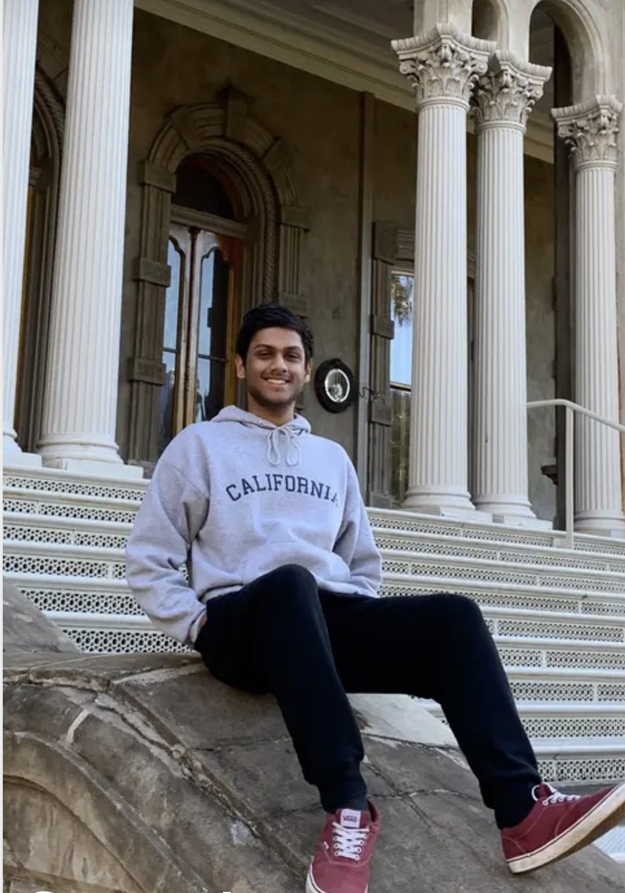
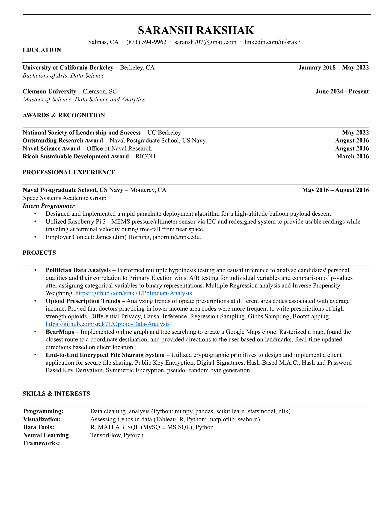

---

# About Me {.tabset}

<center>{width=50%}

I am **Saransh Rakshak**, a passionate data scientist with a strong foundation in data analysis, machine learning, and programming. I hold a Bachelor of Arts in Data Science from the *University of California, Berkeley*, and am currently pursuing a Master of Science in Data Science and Analytics at *Clemson University*. My academic journey has been fueled by a fascination with harnessing data to drive meaningful insights and solutions.

Throughout my education and professional experiences, I have developed a diverse set of technical skills, including Python, R, SQL, and data visualization tools like Tableau and Seaborn. My proficiency in neural learning frameworks such as TensorFlow and PyTorch allows me to implement advanced machine learning models for complex data sets.

I have had the privilege of contributing to the U.S. Navy's Space Systems Academic Group as an intern programmer, where I designed a rapid parachute deployment algorithm and worked with hardware like the Raspberry Pi to capture data in near-space environments. My academic projects, such as analyzing opioid prescription trends and politician election outcomes, reflect my ability to apply data science techniques like causal inference, regression analysis, and differential privacy to real-world problems.

Recognized for my leadership and technical skills, I am a member of the National Society of Leadership and Success and have been awarded for my research at the Naval Postgraduate School. I thrive in collaborative environments where I can combine my analytical expertise with my passion for solving problems that impact society.

---

# Projects {.tabset}

### **Politician Data Analysis**

Performed multiple hypothesis testing and causal inference to analyze candidates' personal qualities and their correlation to Primary Election wins. A/B testing for individual variables and comparison of p-values after assigning categorical variables to binary representations. Multiple Regression analysis and Inverse Propensity Weighting. <https://github.com/srak71/Politician-Analysis>

### **Opioid Prescription Trends**

Analyzing trends of opiate prescriptions at different area codes associated with average income. Proved that doctors practicing in lower income area codes were more frequent to write prescriptions of high strength opioids. Differential Privacy, Causal Inference, Regression Sampling, Gibbs Sampling, Bootstrapping. <https://github.com/srak71/Opioid-Data-Analysis>


### **Bearmaps**

Implemented online graph and tree searching to create a Google Maps clone. Rasterized a map, found the closest route to a coordinate destination, and provided directions to the user based on landmarks. Real-time updated directions based on client location.

### **End-to-End Encrypted File Sharing System**

Utilized cryptographic primitives to design and implement a client application for secure file sharing. Public Key Encryption, Digital Signatures, Hash-Based M.A.C., Hash and Password Based Key Derivation, Symmetric Encryption, pseudo- random byte generation.

---

# Programming Skills {.tabset}

<span style="color: blue;">Programming Languages:</span>

- Python, C, Java, MATLAB: >10 yrs

    - NumPy, Pandas, SciPy, scikitlearn, statsmodel, NLTK, more...

- Go: 3 yrs

<span style="color: violet;">Statistical Languages:</span>

- SQL/MySQL, R , SAS : 6yrs

- SPSS: 2 yrs

<span style="color: yellow;">Large Data Processing:</span>

- (Apache) Hadoop, Hive, Airflow, HBase: 4yrs.

<span style="color: lightgreen;">Neural Learning Frameworks:</span>

- PyTorch: 3 yrs

- TensorFlow: 4 yrs

<span style="color: brown;">Computer Security & Architecture:</span>

- x86: 3 yrs

<span style="color: orange;">Productivity Tools:</span>

- Excel, Sheets: >10yrs

<span style="color: red;">Visualization Tools:</span>

- seaborn, matplotlib, ggplot2, Tableau : 5 yrs

---

# Links {.tabset}

1. linkedIn: <https://www.linkedin.com/in/srak71/>

2. GitHub: <https://github.com/srak71>

---

# Resumè {.tabset}

```{r out.width="100%", out.height="200%", echo=FALSE}

```

---

# Contact Me {.tabset}

Email: saransh707@gmail.com
